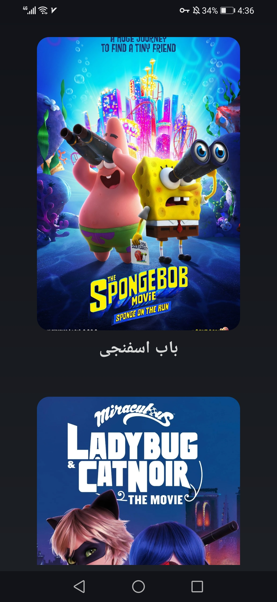
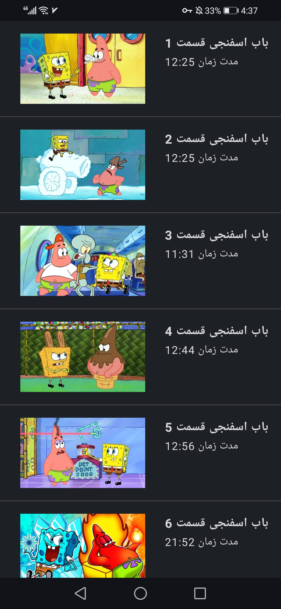
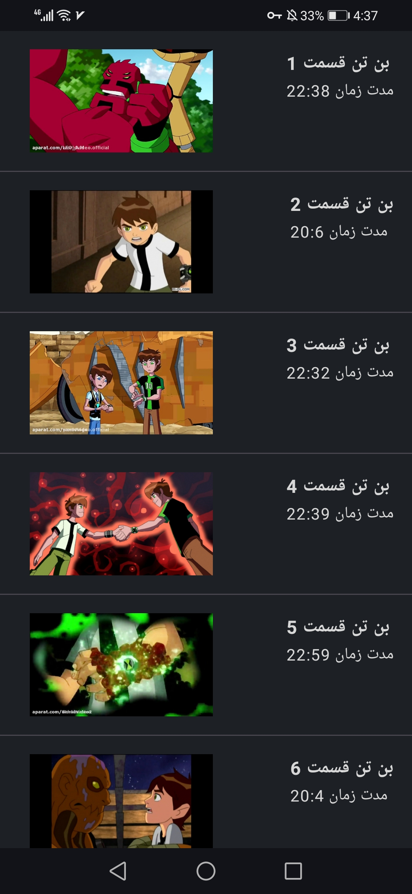
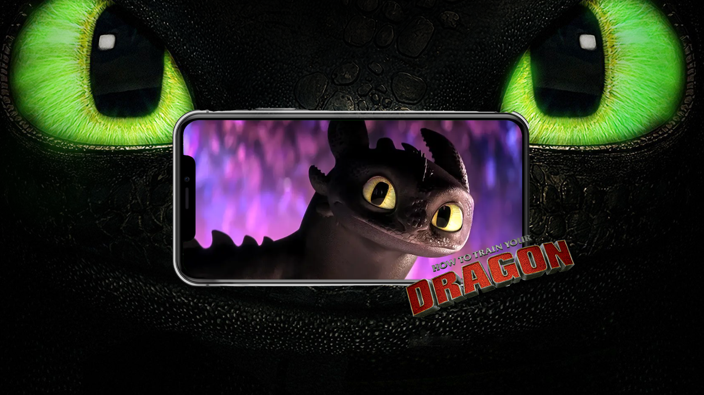
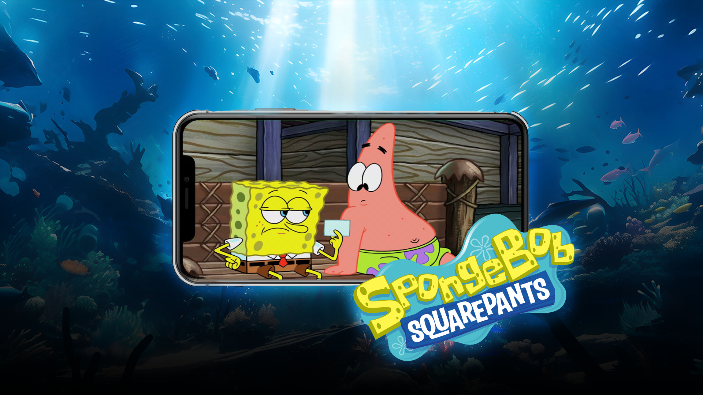
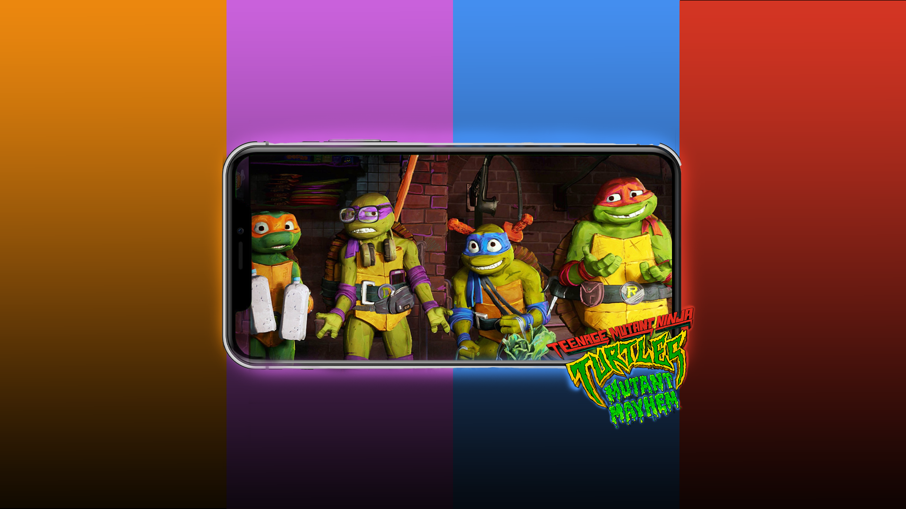

# CartoonBazar   

CartoonBazaar is a simple yet delightful application that brings your favorite cartoon series right to your fingertips. Using the Aparat API, CartoonBazaar offers a seamless experience for watching popular cartoons like Kung Fu Panda, SpongeBob SquarePants, Ben 10, and many more.

Enjoy an extensive library with over 10 different cartoon series, each boasting more than 100 episodes. The user-friendly interface allows you to navigate through your favorite cartoons with ease, and high-quality streaming ensures you can watch cartoons without any interruptions. CartoonBazaar is designed to be simple and focused, providing pure cartoon entertainment without any distractions.
## ScreenShots 

<table>
  <tr>
    <td align="center" width="33%">
      
    </td>
    <td align="center" width="33%">
      
    </td>
    <td align="center" width="33%">
      
    </td>
  </tr>
</table>

  

  

  

  

  

  

  

  

 ## Contributing

We welcome contributions from the community! If you’d like to contribute to CartoonBazaar, feel free to fork the repository and submit a pull request. Whether it’s bug fixes, new features, or improvements, your contributions are greatly appreciated.

  ## License

  This project is licensed under the MIT License.
